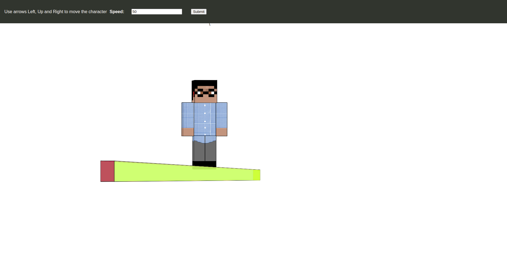
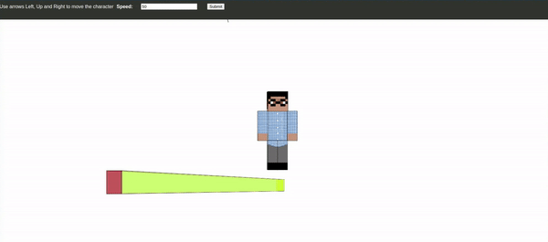

[![LinkedIn][linkedin-shield]][linkedin-url]


<!-- PROJECT LOGO -->
<br />
<p align="center">


  <h1 align="center">Minecraft Character</h1>
    <p align='center'>
  <a href='https://tonijorda.com/myProjects/vanillaJS/MinecraftAnimation/'>View Demo</a>
  </p>
</p>


<!-- ABOUT THE PROJECT -->
## About The Project
    A Minecraft character build with JS vanilla that can moves using the arrow keys.
    


- Main page


- Animation

<br>


<!-- GETTING STARTED -->
###  Getting Started


1. Clone the repo
   ```sh
   git clone https://github.com/Skebard/MinecraftAnimationgit
   ```
2. Open index.html and enjoy :)
<!-- CONTRIBUTING -->
### Contributing

Contributions are what make the open source community such an amazing place to be learn, inspire, and create. Any contributions you make are **greatly appreciated**.

1. Fork the Project
2. Create your Feature Branch (`git checkout -b feature/AmazingFeature`)
3. Commit your Changes (`git commit -m 'Add some AmazingFeature'`)
4. Push to the Branch (`git push origin feature/AmazingFeature`)
5. Open a Pull Request


[linkedin-shield]: https://img.shields.io/badge/-LinkedIn-black.svg?style=for-the-badge&logo=linkedin&colorB=555
[linkedin-url]: http://www.linkedin.com/in/tjorda